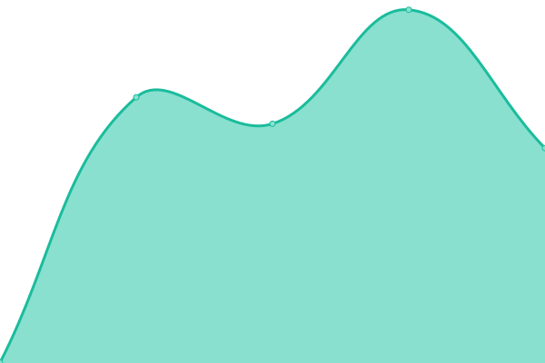

# [📈 Live Status](https://mygameplatform.github.io/status): <!--live status--> **🟧 Partial outage**

This repository contains the open-source uptime monitor and status page for [mygameplatform.com](https://mygameplatform.com), powered by [Upptime](https://github.com/upptime/upptime).

With [Upptime](https://upptime.js.org), you can get your own unlimited and free uptime monitor and status page, powered entirely by a GitHub repository. We use [Issues](https://github.com/mygameplatform/status/issues) as incident reports, [Actions](https://github.com/mygameplatform/status/actions) as uptime monitors, and [Pages](https://mygameplatform.github.io/status) for the status page.

<!--start: status pages-->
<!-- This summary is generated by Upptime (https://github.com/upptime/upptime) -->
<!-- Do not edit this manually, your changes will be overwritten -->
<!-- prettier-ignore -->
| URL | Status | History | Response Time | Uptime |
| --- | ------ | ------- | ------------- | ------ |
|  [Website](https://www.mygameplatform.com) | 🟥 Down | [website.yml](https://github.com/mygameplatform/status/commits/HEAD/history/website.yml) | 

 2018ms
     
 | 

<a href="https://status.mygameplatform.com/history/website">72.87%</a>
    

|  [Wiki](https://wiki.mygameplatform.com:1010) | 🟩 Up | [wiki.yml](https://github.com/mygameplatform/status/commits/HEAD/history/wiki.yml) | 

 927ms
     
 | 

<a href="https://status.mygameplatform.com/history/wiki">53.39%</a>
    

|  [Panel](https://panel.mygameplatform.com) | 🟥 Down | [panel.yml](https://github.com/mygameplatform/status/commits/HEAD/history/panel.yml) | 

 512ms
     
 | 

<a href="https://status.mygameplatform.com/history/panel">99.99%</a>
    

|  [Login-System](https://auth.mygameplatform.com:1020/auth) | 🟩 Up | [login-system.yml](https://github.com/mygameplatform/status/commits/HEAD/history/login-system.yml) | 

 825ms
     
 | 

<a href="https://status.mygameplatform.com/history/login-system">97.44%</a>
    

<!--end: status pages-->

[**Visit our status website →**](https://mygameplatform.github.io/status)

## 📄 License

- Powered by: [Upptime](https://github.com/upptime/upptime)
- Code: [MIT](./LICENSE) © [mygameplatform.com](https://mygameplatform.com)
- Data in the `./history` directory: [Open Database License](https://opendatacommons.org/licenses/odbl/1-0/)
